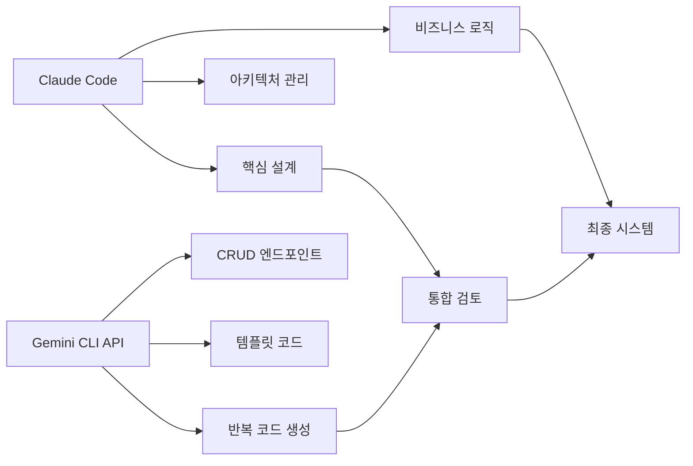

# PLC AI Assistant

> **Cross-platform PLC Programming AI Support System**
> Windows, macOS, Linux 지원 / Gemini CLI API + Claude Code 협업 개발

## 🎯 프로젝트 개요

PLC AI Assistant는 산업용 PLC(Programmable Logic Controller) 프로그래밍을 AI로 지원하는 크로스 플랫폼 시스템입니다. Claude Code가 핵심 아키텍처를 설계하고, Gemini CLI API를 통해 반복적인 코드를 생성하는 혁신적인 AI 협업 개발 방식을 적용했습니다.

## ✨ 주요 기능

### 🏭 PLC 통신
- **미쓰비시 PLC 연결** (MC 프로토콜 Type 3E)
- **실시간 데이터 모니터링** (WebSocket 기반)
- **개발용 시뮬레이터** (실제 PLC 없이 테스트 가능)
- **크로스 플랫폼 지원** (Windows, macOS, Linux)

### 🤖 AI 기능
- **래더 코드 분석** (Ollama 기반)
- **코드 품질 평가** (안전성 점수, 최적화 제안)
- **자연어 코드 생성** (Gemini API 활용)
- **하이브리드 AI 분석** (다중 모델 교차 검증)

### 🌐 웹 인터페이스
- **실시간 대시보드** (PLC 데이터 시각화)
- **AI 분석 도구** (코드 분석/생성 인터페이스)
- **REST API** (FastAPI 기반)
- **WebSocket 스트리밍** (실시간 데이터 전송)

## 🚀 빠른 시작

### 필수 요구사항

- **Python 3.12+**
- **Poetry** (권장) 또는 pip
- **Redis** (선택적)
- **Ollama** (AI 기능용, 선택적)

### 1️⃣ 프로젝트 클론 및 설정

```bash
# Git 클론
git clone <repository-url>
cd plc-ai-assistant

# 초기 설정 (자동)
# Windows
.\scripts\start.ps1 --setup
# 또는
.\scripts\start.bat --setup

# macOS/Linux
./scripts/start.sh --setup
```

### 2️⃣ 환경 변수 설정

`.env` 파일을 생성하거나 수정:

```env
# PLC 설정
PLC_HOST=192.168.1.100
PLC_PORT=1025

# AI 설정 (선택적)
OLLAMA_BASE_URL=http://localhost:11434
OLLAMA_MODEL=codegemma:7b
GEMINI_API_KEY=your_gemini_api_key_here

# Redis 설정 (선택적)
REDIS_URL=redis://localhost:6379
```

### 3️⃣ 서버 시작

```bash
# 개발 모드
# Windows
.\scripts\start.ps1 --dev
.\scripts\start.bat --dev

# macOS/Linux
./scripts/start.sh --dev

# 프로덕션 모드
poetry run uvicorn app.main:app --host 0.0.0.0 --port 8000
```

### 4️⃣ 웹 인터페이스 접속

- **메인 대시보드**: http://localhost:8000
- **AI 기능**: http://localhost:8000/ai.html
- **API 문서**: http://localhost:8000/docs
- **헬스체크**: http://localhost:8000/health

## 🏗️ 아키텍처

### AI 협업 개발 방식



### 시스템 구조

```
plc-ai-assistant/
├── app/
│   ├── main.py              # 메인 애플리케이션 (Claude 작성)
│   ├── config.py            # 설정 관리 (Claude 작성)
│   ├── api/v1/endpoints/    # API 엔드포인트
│   ├── services/            # 핵심 서비스
│   │   ├── plc/            # PLC 통신 (Claude 작성)
│   │   ├── ai/             # AI 서비스 (Claude 작성)
│   │   └── websocket_manager.py  # WebSocket 관리
│   └── utils/
│       └── gemini_helper.py # Gemini API 헬퍼 (Claude 작성)
├── scripts/                 # 크로스 플랫폼 스크립트
│   ├── start.ps1           # Windows PowerShell
│   ├── start.bat           # Windows Batch
│   └── start.sh            # macOS/Linux Bash
├── frontend/               # 웹 인터페이스
├── tests/                  # 테스트
└── docs/                   # 문서
```

## 📱 사용 방법

### PLC 연결

```python
# 실제 PLC 연결
POST /api/v1/plc/connect

# 데이터 읽기
POST /api/v1/plc/read
{
    "device": "D100",
    "count": 1
}

# 데이터 쓰기
POST /api/v1/plc/write
{
    "device": "M101",
    "values": [1]
}
```

### AI 코드 분석

```python
# 래더 코드 분석
POST /api/v1/ai/analyze
{
    "code": "LD X001\nAND X002\nOUT Y001",
    "language": "ladder"
}

# 코드 생성 (Gemini)
POST /api/v1/ai/gemini/generate
{
    "prompt": "시동 버튼으로 모터를 제어하는 래더 로직 생성",
    "context": "안전 인터록 포함"
}
```

### 실시간 모니터링

```javascript
// WebSocket 연결
const ws = new WebSocket('ws://localhost:8000/ws/plc-data');

ws.onmessage = function(event) {
    const data = JSON.parse(event.data);
    console.log('실시간 PLC 데이터:', data.plc_data);
};
```

## 🛠️ 개발 가이드

### AI 협업 워크플로우

1. **Claude Code** - 핵심 설계
   - 프로젝트 아키텍처 설계
   - 비즈니스 로직 구현
   - 보안 및 인증 시스템
   - 코드 검토 및 최적화

2. **Gemini CLI API** - 코드 생성
   - 반복적인 CRUD 함수
   - API 엔드포인트 템플릿
   - 데이터 검증 함수
   - 테스트 케이스

3. **통합 프로세스**
   - Claude가 Gemini 생성 코드 검토
   - 코드 품질 및 일관성 확인
   - 최종 통합 및 최적화

### 개발 환경 설정

```bash
# 개발용 의존성 설치
poetry install --with dev

# 코드 포맷팅
poetry run black app/
poetry run flake8 app/

# 타입 체크
poetry run mypy app/

# 테스트 실행
poetry run pytest tests/ -v
```

### 프로젝트 구조 가이드

- **app/**: 메인 애플리케이션 코드
- **scripts/**: 플랫폼별 실행 스크립트
- **frontend/**: 웹 인터페이스 (HTML/CSS/JS)
- **tests/**: 단위 및 통합 테스트
- **docs/**: 프로젝트 문서

## 🌍 크로스 플랫폼 지원

### Windows
- **PowerShell 스크립트** (`start.ps1`)
- **배치 파일** (`start.bat`)
- **Chocolatey** 패키지 매니저 지원
- **Docker** 컨테이너 지원

### macOS
- **Bash 스크립트** (`start.sh`)
- **Homebrew** 패키지 매니저 지원
- **네이티브 서비스** 통합

### Linux
- **Bash 스크립트** (`start.sh`)
- **APT/DNF/YUM** 패키지 매니저 지원
- **Systemd** 서비스 지원

## 🔧 설정 옵션

### PLC 설정
```env
PLC_HOST=192.168.1.100    # PLC IP 주소
PLC_PORT=1025             # MC 프로토콜 포트
PLC_TIMEOUT=5             # 연결 타임아웃 (초)
```

### AI 설정
```env
# Ollama (로컬 AI)
OLLAMA_BASE_URL=http://localhost:11434
OLLAMA_MODEL=codegemma:7b

# Gemini API (클라우드 AI)
GEMINI_API_KEY=your_api_key_here
```

### 성능 튜닝
```env
# WebSocket 설정
WS_PING_INTERVAL=30
WS_PING_TIMEOUT=10

# Redis 캐싱
REDIS_URL=redis://localhost:6379
CACHE_TTL=300
```

## 📊 모니터링

### 시스템 헬스체크
- **CPU/메모리 사용률**: `/api/v1/system/health`
- **PLC 연결 상태**: `/api/v1/plc/status`
- **AI 서비스 상태**: `/api/v1/ai/status`
- **WebSocket 연결수**: `/api/v1/system/websocket/status`

### 로그 관리
- **로그 레벨 조정**: `/api/v1/system/logs/level/{level}`
- **실시간 로그 모니터링**: WebSocket 스트리밍
- **오류 알림**: 시스템 알림 브로드캐스트

## 🧪 테스트

### 단위 테스트
```bash
# 전체 테스트
poetry run pytest

# 특정 모듈 테스트
poetry run pytest tests/test_plc_connection.py

# 커버리지 리포트
poetry run pytest --cov=app tests/
```

### 통합 테스트
```bash
# API 엔드포인트 테스트
poetry run pytest tests/test_api.py

# PLC 시뮬레이터 테스트
poetry run pytest tests/test_simulator.py
```

## 🚀 배포

### Docker 배포
```bash
# Docker 이미지 빌드
docker build -t plc-ai-assistant .

# 컨테이너 실행
docker run -d \
  --name plc-ai-assistant \
  -p 8000:8000 \
  -e PLC_HOST=192.168.1.100 \
  plc-ai-assistant
```

### 시스템 서비스 (Linux)
```bash
# systemd 서비스 등록
sudo cp deployment/plc-ai-assistant.service /etc/systemd/system/
sudo systemctl daemon-reload
sudo systemctl enable plc-ai-assistant
sudo systemctl start plc-ai-assistant
```

## 🤝 기여 방법

### AI 협업 개발 참여

1. **Gemini API 기여**
   - 새로운 코드 생성 템플릿 추가
   - 데이터 검증 로직 개선
   - 테스트 케이스 자동 생성

2. **Claude Code 리뷰**
   - 아키텍처 개선 제안
   - 보안 취약점 검토
   - 성능 최적화

### 개발 참여 절차

1. Fork 및 브랜치 생성
2. AI 협업 가이드라인 따르기
3. 테스트 작성 및 실행
4. Pull Request 제출
5. 코드 리뷰 및 통합

## 📄 라이선스

MIT License - 자세한 내용은 [LICENSE](LICENSE) 파일 참조

## 🙋‍♂️ 지원 및 문의

- **GitHub Issues**: 버그 리포트, 기능 요청
- **Documentation**: [프로젝트 위키](wiki-url)
- **Community**: [Discussions](discussions-url)

---

**Made with 🤖 AI Collaboration**
*Claude Code + Gemini CLI API = Innovative Development*